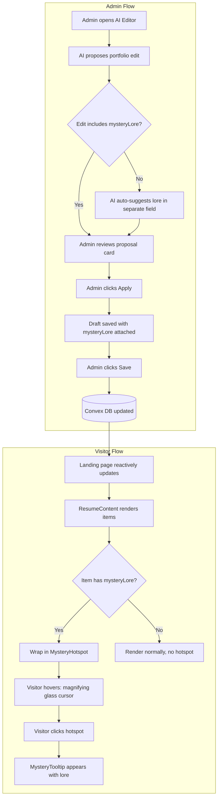
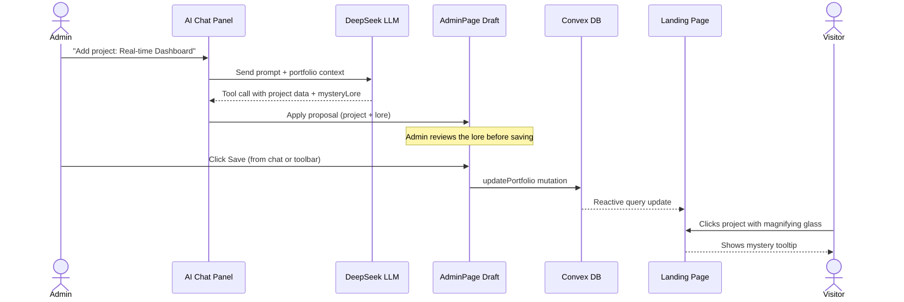

# M008 — Magnifying Mystery Mode

## Problem Statement

The old "Quest Awaits" modal was an intrusive, mandatory blocker that annoyed visitors. It forced them into a game flow they didn't ask for. It's gone. But the landing page is now a plain resume with zero interactivity — it doesn't reward curiosity or leave any impression.

We need a **non-blocking, exploration-based** engagement layer that:
- Doesn't interrupt the reading flow.
- Rewards curious visitors who explore.
- Stays fresh automatically when the admin edits the portfolio.

---

## Concept: Magnifying Mystery Mode

When a visitor lands on the resume, the cursor transforms into a **magnifying glass**. Certain resume items (skills, projects, experience) become interactive **hotspots**. Clicking one reveals a small, elegant tooltip with a fun fact, metric, or behind-the-scenes story — the "mystery lore."

Key difference from the old game: **nothing is forced.** Visitors who just want to read the resume can ignore the magnifying glass entirely. Those who are curious get rewarded with hidden depth.

---

## System Architecture





---

## Design Specification

### Magnifying Glass Cursor
- **Implementation:** CSS `cursor: url(magnifier.svg) 16 16, zoom` on `.lp-paper`.
- **SVG spec:** 32×32px, 2px stroke, semi-transparent fill, subtle drop-shadow.
- **Performance:** Use a static SVG cursor via CSS — no JS-driven cursor follower. This avoids requestAnimationFrame overhead and works natively across browsers.
- **Fallback:** Browsers that don't support custom cursors get `cursor: zoom-in`.

### Hotspot Indicators
- Items WITH `mysteryLore` get a subtle visual hint:
  - A faint `🔍` icon floats at the end of the item text (opacity 0.3, rises to 0.7 on hover).
  - On hover, the item text gets a soft warm underline glow (`box-shadow: inset 0 -2px 0 rgba(251, 191, 36, 0.4)`).
- Items WITHOUT `mysteryLore` render completely normally — no hotspot, no cursor change, no glow.

### MysteryTooltip Component
- **Position:** Anchored below the clicked hotspot, centered horizontally. Flips above if near viewport bottom.
- **Style:** Matches existing `.resume-ai-panel` design language:
  - `background: rgba(15, 23, 42, 0.95)` (dark card)
  - `border: 1px solid rgba(251, 191, 36, 0.3)` (amber accent)
  - `backdrop-filter: blur(12px)`
  - `border-radius: 14px`
  - `max-width: 320px`
- **Content layout:**
  - Small `🔍` icon + "MYSTERY LORE" label at top (uppercase, 0.7rem, amber color)
  - Lore text body (0.85rem, white, `line-height: 1.5`)
- **Animations:**
  - Enter: scale from 0.92 → 1.0 + fade in (150ms ease-out)
  - Exit: fade out (100ms)
- **Dismiss:** Click outside, press Escape, or scroll away.

### Mobile Behavior (Tap-to-Reveal)
- Custom cursor is disabled on touch devices (`@media (pointer: coarse)`).
- Hotspot indicator changes: the `🔍` icon becomes slightly more visible (opacity 0.5) so touch users know items are tappable.
- Tap opens the tooltip; tap outside dismisses.
- No double-tap or long-press — single tap only.

---

## Data Model Changes

### `portfolioTypes.ts` — Add optional `mysteryLore` to relevant interfaces

```typescript
// Each interface gets an optional field:
export interface ResumeSkillGroup {
  label: string;
  items: string[];
  mysteryLore?: string;  // NEW
}

export interface EducationItem {
  degree: string;
  school: string;
  period: string;
  detail: string;
  mysteryLore?: string;  // NEW
}

export interface ExperienceItem {
  role: string;
  period: string;
  description: string;
  mysteryLore?: string;  // NEW
}

export interface PortfolioProject {
  name: string;
  period: string;
  stack: string;
  description: string;
  links?: { label: string; url: string }[];
  mysteryLore?: string;  // NEW
}
```

### Convex Schema
- The `content` field in the `portfolio` table is a JSON blob. Since `mysteryLore` is optional, no schema migration is needed — existing data continues to work. New saves include the field when present.

---

## AI Agent Integration

### How it works
When the AI proposes an edit (e.g., `proposeProjectEdit`), the tool definition will include an optional `mysteryLore` field per item. The AI system prompt will be updated to instruct the LLM:

> "For every project, skill group, experience, or education entry you create or modify, include a `mysteryLore` field: a single short sentence (max 120 chars) with a fun fact, metric, or behind-the-scenes insight about that item. Make it specific and grounded in the data provided. Do NOT fabricate statistics."

### Admin approval gate
The admin sees the mystery lore as part of the standard proposal card:
- The proposal card already shows `description` and `data`.
- `mysteryLore` will appear as a sub-line under each item in the proposal preview.
- The admin must click **Apply** to accept — there is no auto-commit path.
- If the admin doesn't like the lore, they can ask the AI to regenerate it or manually edit it after applying.

### Tool definition changes
Each tool's item schema gets:
```json
"mysteryLore": { "type": "string", "description": "Short fun fact for the magnifying mystery feature (max 120 chars)" }
```
This field is NOT in `required` — the AI can omit it, and existing items without lore simply won't show a hotspot.

---

## Action Plan

### Slice 1 — Data Model & AI Agent (Backend)
- [ ] Add optional `mysteryLore?: string` to `ResumeSkillGroup`, `EducationItem`, `ExperienceItem`, and `PortfolioProject` in `portfolioTypes.ts`.
- [ ] Add `mysteryLore` property to each tool definition array item in `PORTFOLIO_TOOLS` (`aiAgent.ts`).
- [ ] Update the admin system prompt in `aiAgent.ts` to instruct lore generation.
- [ ] Verify: Convex schema needs no migration (content is a JSON blob with optional fields).
- [ ] Run `tsc --noEmit` — must pass.

### Slice 2 — Magnifying Glass Cursor & Hotspot Wrapper (Frontend)
- [ ] Create `magnifier.svg` (32×32, clean magnifying glass icon).
- [ ] Add CSS rule: `.lp-paper { cursor: url(/magnifier.svg) 16 16, zoom; }`.
- [ ] Add `@media (pointer: coarse)` override to disable custom cursor on touch.
- [ ] Build `<MysteryHotspot>` wrapper component:
  - Props: `lore: string | undefined`, `children: ReactNode`.
  - If `lore` is undefined/empty → render children unwrapped (no hotspot).
  - If `lore` exists → wrap children in a clickable container with hover glow + `🔍` indicator.
- [ ] Wrap skill groups, projects, experiences, and education items in `<MysteryHotspot>` inside `ResumeContent`.

### Slice 3 — MysteryTooltip Component (Frontend)
- [ ] Build `<MysteryTooltip>` component (positioned popup, dark card, amber accent).
- [ ] Implement positioning logic: anchor below hotspot, flip above near viewport bottom.
- [ ] Add enter/exit CSS animations (scale + fade).
- [ ] Implement dismiss: click-outside, Escape key, scroll-away.
- [ ] Mobile: single tap opens, tap-outside dismisses.

### Slice 4 — Backfill Existing Data
- [ ] Use the AI Chat in admin mode to regenerate existing portfolio items with `mysteryLore` attached.
- [ ] Strategy: The admin asks "Add mystery lore to all my projects" → AI reads current data, proposes edits with lore attached → admin reviews and applies.
- [ ] This is a **manual, admin-driven** process — no silent automation. The admin approves every piece of lore.

### Slice 5 — Polish & Edge Cases
- [ ] Verify: items without `mysteryLore` render identically to current behavior (zero regression).
- [ ] Verify: magnifying glass cursor does not cause scroll jank on large pages.
- [ ] Test mobile tap-to-reveal on iOS Safari and Android Chrome.
- [ ] Add a subtle page-load hint: a small toast or badge "🔍 Try clicking on items to discover hidden facts" that appears once per session and auto-dismisses after 4s. Stored in `sessionStorage` so it doesn't nag.

---

## Files Expected to Change

| File | Change |
|------|--------|
| `src/content/portfolioTypes.ts` | Add optional `mysteryLore` to 4 interfaces |
| `convex/aiAgent.ts` | Add `mysteryLore` to tool schemas + system prompt |
| `src/components/LandingPage.tsx` | Wrap items in `<MysteryHotspot>`, import tooltip |
| `src/components/MysteryHotspot.tsx` | New component — hotspot wrapper |
| `src/components/MysteryTooltip.tsx` | New component — tooltip popup |
| `style.css` | Custom cursor, hotspot glow, tooltip card, animations |
| `public/magnifier.svg` | New asset — cursor SVG |

---

## Out of Scope (for now)
- **Analytics/tracking** of which hotspots get clicked. Can be added in a future milestone once the core feature proves engaging.
- **Admin UI for editing mysteryLore directly** in the inline editor (currently only via AI chat). Low priority since the AI handles it well.
- **Animated cursor follower** (JS-based). The CSS cursor approach is simpler, performs better, and covers 95% of browsers.

---

## Success Criteria
1. Visitor sees magnifying glass cursor on resume — zero jank.
2. Clicking a lore-enabled item shows an elegant tooltip — dismissible.
3. Items without lore look exactly as before — zero visual regression.
4. AI auto-generates lore when admin creates/edits items — admin always reviews before save.
5. Mobile: tap-to-reveal works on iOS Safari and Android Chrome.
